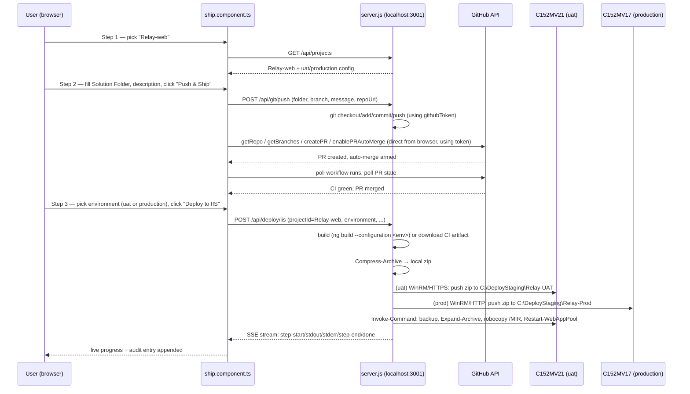

# Ship Tab — End-to-End Walkthrough for `Relay-web`

This document explains exactly what happens, click by click and line by line,
when the **Ship** tab is used for the `Relay-web` project (id `Relay-web` in
`server-config.json`, GitHub repo `Manish081998/Relay-WEB`). It only covers
this one project's configured path — not the generic feature set (see
`DEPLOY_SETUP.md` for that).

> Credentials are masked below (`«masked»`) — never paste raw secrets from
> `server-config.json` into a shared document.

## 1. Where everything lives

| Layer | File |
|---|---|
| UI (3-step wizard) | [ship.component.ts](src/app/features/ship/ship.component.ts), [ship.component.html](src/app/features/ship/ship.component.html) |
| Git push logic (client) | [git-push.service.ts](src/app/core/services/git-push.service.ts) |
| GitHub PR pipeline (client) | [pipeline.service.ts](src/app/core/services/pipeline.service.ts) |
| Deploy wizard client | [deploy.service.ts](src/app/core/services/deploy.service.ts) |
| Backend (Express, port 3001) | [server.js](server.js) |
| Registry / secrets | [server-config.json](server-config.json) (git-ignored, loaded once at server startup) |
| Deploy history | [deploy-audit.log](deploy-audit.log) (one JSON line per deploy attempt) |

The frontend never talks to GitHub or to the IIS servers directly — it only
talks to `http://localhost:3001` (`GIT_SERVER_BASE` in
[api.constants.ts](src/app/core/constants/api.constants.ts)), and `server.js`
does the real work (git CLI, GitHub REST API, PowerShell/WinRM).

## 2. Relay-web's registry entry

From `server-config.json` (`projects[]`):

```json
{
  "id": "Relay-web",
  "name": "Relay-web",
  "type": "angular",
  "repo": "Manish081998/Relay-WEB",
  "environments": {
    "uat": {
      "server": "C152MV21.ADTICORP.COM",
      "sharePath": "C:\\DeployStaging\\Relay-UAT",
      "destPath": "C:\\inetpub\\wwwroot\\ProjectRelay_Web",
      "appPoolName": "DefaultWebSites",
      "credentialRef": "iis-default",
      "useSsl": true,
      "backupPath": "G:\\ProjectRelay_BackUp\\WEB",
      "healthCheckUrl": "",
      "buildCommand": "ng build --configuration uat"
    },
    "production": {
      "server": "C152MV17.ADTICORP.COM",
      "sharePath": "C:\\DeployStaging\\Relay-Prod",
      "destPath": "C:\\inetpub\\wwwroot\\ProjectRelay_Web",
      "appPoolName": "DefaultWebSites",
      "credentialRef": "iis-default",
      "backupPath": "H:\\ProjectRelay_BackUp\\WEB",
      "healthCheckUrl": "",
      "buildCommand": "ng build --configuration production"
    }
  }
}
```

`credentials.iis-default` resolves to `adm-manish.gupta@ADTICORP.COM` /
`«masked»` — the Windows account WinRM uses on both target servers.

What this means concretely, derived from [server.js:1023-1071](server.js#L1023-L1071):

| Property | Effect for Relay-web |
|---|---|
| `type: "angular"` | Build step runs `ng build`, output resolved from `angular.json`'s `outputPath` |
| `repo` present | `hasCiRepo = true` → the "Deploy CI Build" picker is available in Step 3 |
| `buildCommand` set per environment | The build-options dropdown shows **exactly one** fixed option — `ng build --configuration uat` or `ng build --configuration production` — never an auto-detected list, because [`resolveBuildOptions`](server.js#L573-L620) short-circuits as soon as an env-level `buildCommand` exists |
| `uat.useSsl: true`, `production` omits it (→ `false`) | Staging/deploy PowerShell connects to `C152MV21` over WinRM-**HTTPS** (5986) but to `C152MV17` over plain WinRM (5985) |
| `requireApproval` not set on either env | Defaults to `name.toLowerCase() === 'production'` → **uat needs no confirmation, production does** ([server.js:1032](server.js#L1032), [server.js:1149](server.js#L1149)) |
| `backupPath` set on both | Every deploy backs up the current live site first (`hasBackup: true`) |
| `healthCheckUrl: ""` on both | Step 4 ("Verify Site") is a no-op skip for Relay-web — no post-deploy HTTP check happens |
| `destPath` identical for uat/prod (`ProjectRelay_Web`) | Only safe because uat and production point at **different physical servers** (`C152MV21` vs `C152MV17`) — same folder name, different machine |

## 3. The 3-step wizard, end to end



### Step 1 — Select Project

- `ship.component.ts` calls `loadDeployProjects()` on init, which hits
  `GET /api/projects` ([server.js:1023](server.js#L1023)).
- Relay-web appears in the dropdown with `configured: true` for both `uat`
  and `production` (every required field is present).
- Picking it calls `selectProject('Relay-web')`
  ([ship.component.ts:346](src/app/features/ship/ship.component.ts#L346)):
  - defaults `selectedEnvironment` to the first `configured` env (`uat`,
    since it's declared first in the JSON),
  - kicks off `loadBuildOptions()` and, because `hasCiRepo` is true,
    `loadCiBuilds()`,
  - loads recent deploy history for `Relay-web` from `deploy-audit.log`,
  - advances the wizard to Step 2.

### Step 2 — Push & Ship (git + GitHub PR pipeline)

This step is **project-agnostic** — it operates on whatever GitHub repo URL
is entered/selected (for Relay-web that's `Manish081998/Relay-WEB`) and is
completely independent of the environment picked in Step 3. It runs in two
phases when "Push & Ship" is clicked (`runAll()`,
[ship.component.ts:546](src/app/features/ship/ship.component.ts#L546)):

**Phase A — local build + git push** (`streamGitPush`, backed by
`POST /api/git/push`, [server.js:288-421](server.js#L288-L421)):

1. `git init` if the Solution Folder isn't a repo yet.
2. Ensure `origin` points at the Relay-WEB clone URL.
3. `git fetch origin`.
4. If the local repo has no commits yet, either sync with an existing
   remote `main`/`development` or bootstrap a fresh repo (commit → push
   `main` → branch `development`).
5. Ensure the source branch (default `development`) exists locally.
6. Merge `origin/main` into it with `--allow-unrelated-histories -X ours`
   so GitHub can create a PR even on a brand-new local checkout.
7. Auto-create `.github/workflows/build.yml` **only if missing** — Relay-WEB
   already has a hand-written, per-environment workflow committed (per
   `DEPLOY_SETUP.md`), so this step is normally a no-op for Relay-web.
8. Run the 5 visible steps: **Checkout → Stage → Status → Commit → Push**,
   streamed live to the UI as `git-steps`.

**Phase B — GitHub PR pipeline** (`pipeline.service.ts`, runs entirely from
the browser using the GitHub token, no server involvement beyond git push):

1. **Validate Repo** — `GET /repos/Manish081998/Relay-WEB`.
2. **Check Branches** — confirm head (`development`) and base (`main`)
   exist; also (re)commits the CI workflow file via the GitHub Contents API.
3. **Detect PR** — look for an existing open PR `development → main`.
4. **Create PR** — open one if none exists (title/body = the "What did you
   change?" description).
5. **Auto-merge** — enable GitHub's native auto-merge on the PR so it merges
   itself once checks pass (falls back to a skipped step if the repo doesn't
   allow it).
6. **Monitor CI** — poll `GET /actions/runs` up to 20× (~60s) for the
   `build.yml` workflow's status/conclusion.
7. **PR Merged** — poll up to 48× (~120s) until the PR shows `merged: true`,
   or report it's still open awaiting manual approval.

At the end of Phase B, Relay-WEB has (assuming CI passed and branch
protection allows auto-merge) a merged PR into `main` — **but nothing has
been deployed anywhere yet.** Deploy is a fully separate, manual action.

### Step 3 — Deploy to IIS

Deploy is deliberately decoupled from Phase A/B — the UI even warns "No
merged PR detected yet — this deploys whatever is currently built", so it's
possible (and normal) to redeploy an old build, or deploy before a PR
merges, purely from what's on disk / in CI artifacts.

**Choosing the source** (only shown because `hasCiRepo` is true for
Relay-web):

- **🏗 Build Locally** (default) — rebuilds from the Solution Folder on this
  machine using the fixed command for the chosen environment:
  `ng build --configuration uat` or `ng build --configuration production`.
- **📦 Deploy CI Build** — calls `GET /api/projects/Relay-web/ci-builds?environment=uat|production`
  ([server.js:1054](server.js#L1054), [`listCiBuilds`](server.js#L764-L802)),
  which lists GitHub Actions artifacts named `build-uat` / `build-production`
  from Relay-WEB's own `build.yml` (only uploaded after its `test` job
  passes) and lets you pick one by branch/SHA/run number — no rebuild
  happens on this machine at all in this mode.

**Environment gate:** picking `production` sets `requiresApproval = true`
([ship.component.ts:142](src/app/features/ship/ship.component.ts#L142)), so
the **Deploy to IIS** button stays disabled until the exact word
`production` is typed into the confirm box. `uat` has no such gate.

Clicking **🚀 Deploy to IIS** calls `deploy()`
([ship.component.ts:610](src/app/features/ship/ship.component.ts#L610)),
which POSTs a `DeployRequest` to `/api/deploy/iis` and streams back
Server-Sent Events. On the server ([server.js:1091-1343](server.js#L1091-L1343)),
for `projectId: "Relay-web"`:

0. **Lock** — refuses to start if a deploy for `Relay-web:uat` (or
   `:production`) is already running (`deployLocks`), so two people can't
   race the same environment; each environment locks independently.

1. **Publish Build** (`id: publish`)
   - *Local source:* runs `resolveBuildOptions` → gets back the single fixed
     command for that env → [`runPublishStep`](server.js#L645-L694) executes
     it via `powershell.exe -Command "ng build --configuration uat"` (or
     `production`) in the Solution Folder, then resolves the output dir from
     `angular.json`'s `outputPath` (handling the newer builder's nested
     `browser/` subfolder), and copies `index.csr.html` → `index.html` if
     Relay-web's build is SSR-capable but has no Node host in front of IIS.
   - *CI source:* downloads the chosen artifact zip directly from GitHub
     (`/repos/Manish081998/Relay-WEB/actions/artifacts/{id}/zip`) into a temp
     folder and extracts it with `Expand-Archive` — no `ng build` runs here.

2. **Copy to Staging** (`id: stage`)
   - `Compress-Archive` zips the publish output into one file in the OS
     temp folder (`%TEMP%\Relay-web-uat-deploy.zip`, `-CompressionLevel Fastest`).
   - [`buildStageScript`](server.js#L945-L964) maps the target's local drive
     (`C:\DeployStaging\Relay-UAT` or `...\Relay-Prod`) to a `New-PSDrive`
     against that server's **C$ admin share**, authenticating as
     `adm-manish.gupta@ADTICORP.COM`, and does a plain SMB `Copy-Item` of the
     zip — for `uat` this connects over WinRM-**HTTPS** (`useSsl: true`), for
     `production` over plain WinRM. This is a single-hop copy straight onto
     the target server's own disk (not a UNC share), which is what avoids
     the WinRM "double-hop" credential problem entirely.

3. **Deploy on Server** (`id: deploy`)
   - [`buildDeployScript`](server.js#L971-L1020) opens
     `Invoke-Command -ComputerName <C152MV21|C152MV17> -Credential $cred`
     and, **on that remote server**:
     - if `backupPath` is set (it is, for both envs) — `robocopy`-mirrors the
       *current* `destPath` (`C:\inetpub\wwwroot\ProjectRelay_Web`) into a
       timestamped folder under `G:\ProjectRelay_BackUp\WEB` (uat) or
       `H:\ProjectRelay_BackUp\WEB` (production) — this is the rollback
       point if the new build is bad;
     - `Expand-Archive`s the pushed zip into a scratch `extract_*` folder
       next to it;
     - `robocopy /MIR`s that extracted tree onto `destPath`, so leftover
       files from a previous deploy are removed, not just overwritten;
     - `Restart-WebAppPool -Name DefaultWebSites` to pick up the new files.

4. **Verify Site** (`id: verify`)
   - Relay-web's `healthCheckUrl` is `""` on both environments, so this step
     is always reported as a **skipped no-op** — a successful deploy does
     **not** get an automatic post-deploy HTTP check for either uat or
     production today.

5. **Finally** (always runs, success or failure):
   - deletes the local zip and any CI-artifact temp folder,
   - appends one line to `deploy-audit.log`: timestamp, OS username, project,
     environment, which build/CI info was used, outcome, failing stage (if
     any), and a per-step duration breakdown,
   - on success, sends `done` — the UI marks the card "Deployed" and shows
     the elapsed time.

**Cancelling:** while running, `POST /api/deploy/cancel {projectId, environment}`
flips a `cancelled` flag and force-kills the current child process tree
(`taskkill /T /F`, since a killed `npm.cmd`/`robocopy` leaves orphans on
Windows otherwise) — the next `bailIfCancelled()` checkpoint then reports a
clean "Cancelled by user" instead of a half-finished error.

## 4. Consequences specific to Relay-web's exact config

- Because `uat` and `production` are two entirely different physical
  Windows servers, a bad `production` deploy can't be "fixed" by looking at
  `uat` — check `H:\ProjectRelay_BackUp\WEB` on `C152MV17` for the pre-deploy
  backup, not `G:\...` on `C152MV21`.
- There is currently no automated health check for either environment — a
  "Deployed" green result only means the app pool restarted, not that the
  site is actually serving traffic correctly. Anyone deploying Relay-web
  should manually load the site after a deploy until `healthCheckUrl` is
  filled in.
- Since `buildCommand` is hardcoded per environment, changing Relay-web's
  Angular build configuration (e.g. adding a `staging` config) requires
  editing `server-config.json` directly — the dashboard won't auto-detect
  new `angular.json` configurations for this project as long as
  `buildCommand` stays set.
- `uat`'s `useSsl: true` vs `production`'s implicit `false` means the two
  environments have different WinRM failure modes — see
  [DEPLOY_SETUP.md § WinRM connection problems](DEPLOY_SETUP.md#winrm-connection-problems)
  if staging/deploy hangs or times out for one environment but not the other.
